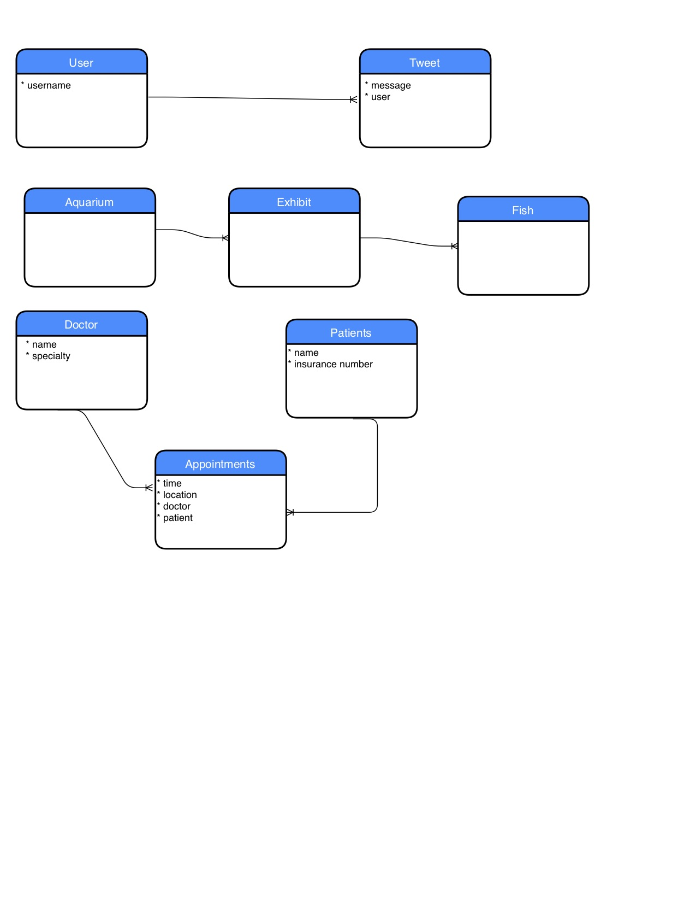
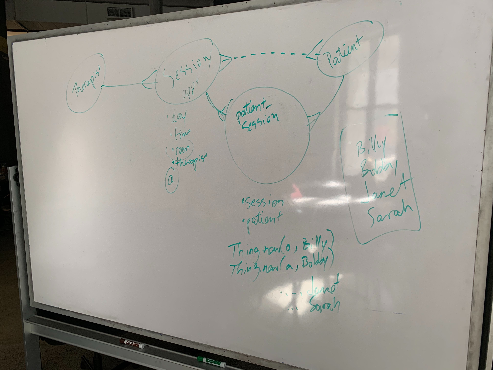
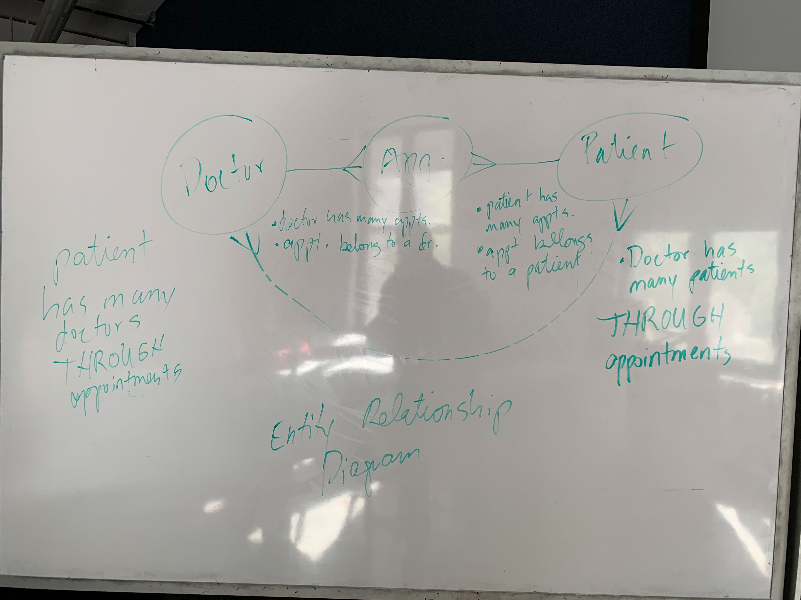

# Many to Many Relationships

## Objectives

* [ ] Implement both sides of a many to many relationship
* [ ] Practice keeping groups of data related to classes on the class as a class variable
* [ ] Demonstrate single source of truth by not storing collections of objects on other objects
* [ ] Demonstrate single source of truth by not storing one object in multiple collections

## ERD Diagrams

## Deliverables

* Create a _User_ class. The class should have these methods:
  * [x] `User#initialize` which takes a username
  * [x] `User#username` reader method
  * [x] `User#tweets` that returns an array of Tweet instances
  * [x] `User#post_tweet` that takes a message, creates a new tweet, and adds it to the user's tweet collection  
  * [ ] `User.print_tweets` that prints the message of each tweet to the screen in a _pretty_ way (be creative)
  * [ ] `User#like_tweet` that accepts a tweet instance as a parameter
  * [ ] `User#liked_tweets` that returns a collection of all the tweets this user has liked

   

* Create a _Tweet_ class. The class should have these methods:
	* [x] `Tweet#initialize` which takes a message and a user
	* [x] `Tweet#message` that returns a string
	* [x] `Tweet#author` that returns an instance of the user class
	* [x] `Tweet.all` that returns all the Tweets created.
	* [ ] `Tweet#author_name` that returns the username of the tweet's user
	* [ ] `Tweet#likers` that returns a collection of all the Users who have liked this tweet

## Key Concepts

**Art Gallery**
* gallery ----< shows ----< paintings
* Gallery.new(name) <#Gallery:af647dd>
* Show.new(date, name, gallery)
* Painting.new(painter, title, date, show)
 

**Doctor's Office**
* doctor ----< appointments >---- patient
* Doctor.new(name)
* Appointment.new(time, date, location, doctor, patient)
* Patient.new(name)
 

**Family Therapist**
* therapist ----< session ----< patient_session >---- patient
* Therapist.new(name)
* Session.new(date, time, therapist)
* Patient.new(name)
* PatientSession.new(session, patient)

**Twitter**
* user ----< like >---- tweet >---- user
* User.new(username)
* Tweet.new(message, user)
* Like.new(user, tweet)

## Discussion Questions
1. What is the difference between a one-to-many and a many-to-many relationship?
2. What does 'has many through' mean?
